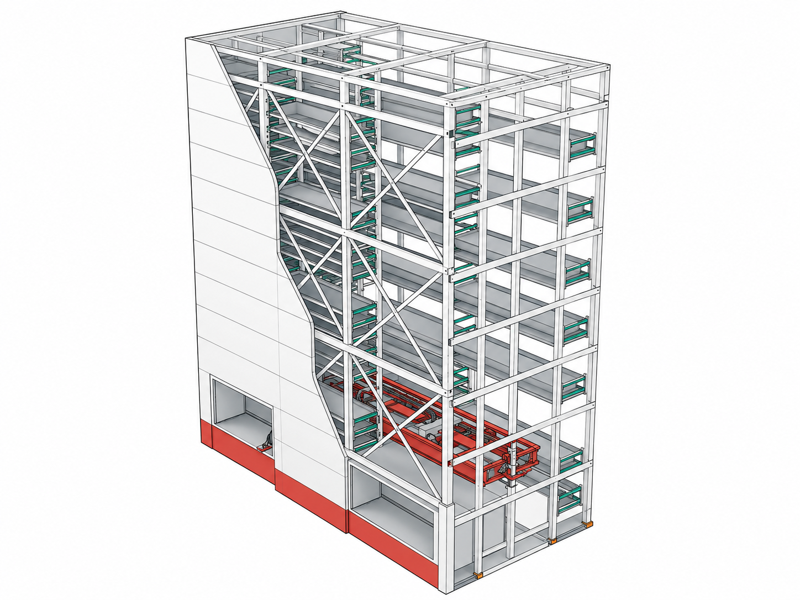
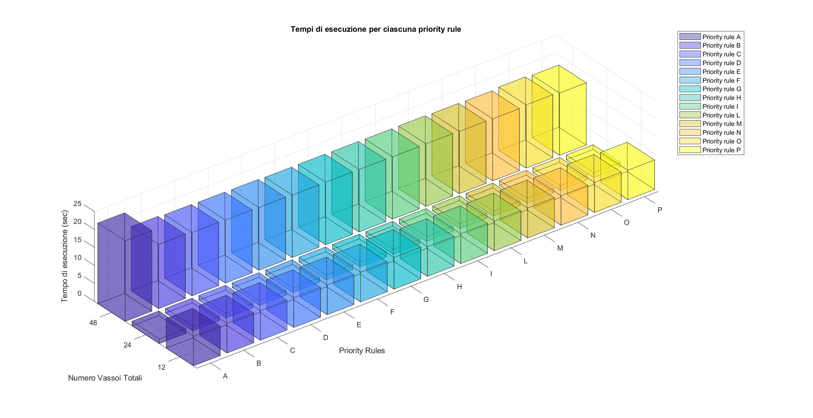
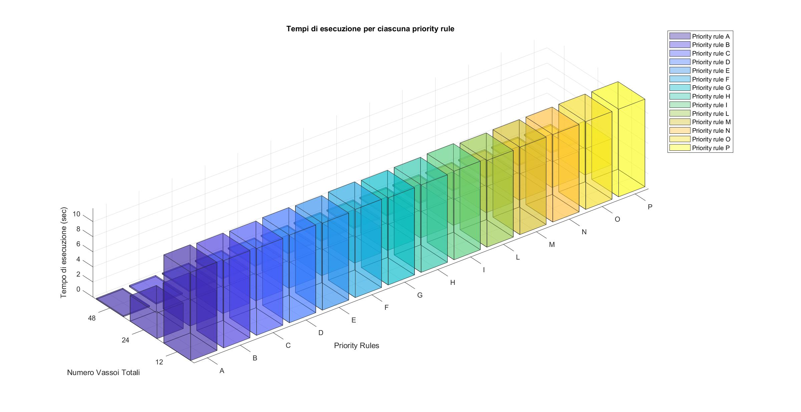
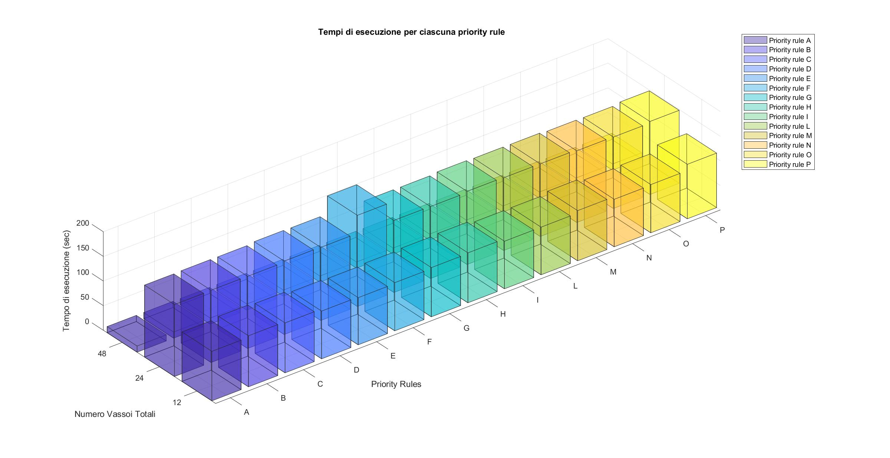
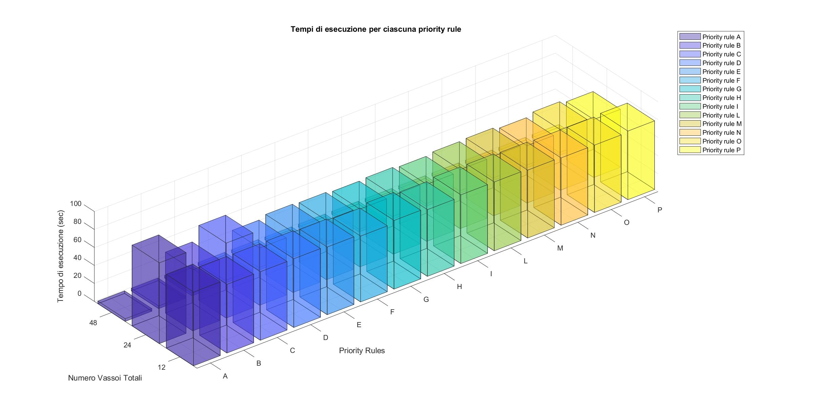

# Vertical Warehouse Optimization
---


MATLAB project for optimizing tray allocation in Vertical Lift Modules (VLMs), with the goal of reducing wasted space, maximizing column fill ratio, and comparing different allocation priority rules.

The project models the storage of trays with different heights inside fixed-height warehouse columns. It evaluates how different priority criteria affect the final storage configuration, the number of columns used, the remaining free space, and the execution time.
<p align="center">
  
</p>

---

## Overview

Vertical Lift Modules are automated storage systems that exploit vertical space to reduce floor usage and improve material handling efficiency.

This project focuses on the optimization of tray allocation inside vertical warehouse columns. Given a set of tray types, tray quantities, and column-height constraints, the algorithm determines how trays should be assigned to columns while minimizing unused vertical space.

The case study is inspired by ICAM SILO² vertical warehouse configurations.

---

## Problem statement

The input of the problem is a set of trays characterized by:

- tray height;
- tray quantity;
- number of tray types;
- fixed column height;
- handling clearance between trays.

The objective is to allocate full trays into fixed-height columns and then use empty trays to reduce the remaining free space.

The main goals are:

- maximize the occupied space in each column;
- minimize the unused vertical space;
- reduce the number of required columns;
- compare different priority rules;
- evaluate fill ratio, residual free space, execution time, and number of columns used.

---

## Input data

The simulations use several warehouse and tray configurations.

Main input parameters:

| Parameter | Meaning |
|---|---|
| `N` | Total number of trays |
| `T` | Number of tray types |
| `a_i` | Height of tray type `i` |
| `n_i` | Available quantity of tray type `i` |
| `in_i` | Quantity of tray type `i` already inserted |
| `hC` | Column height |
| `hCf` | Remaining free height in a column |

The reference study considers:

| Quantity | Values |
|---|---|
| Tray heights | 75, 125, 225, 325 mm |
| Column heights | 3000, 9000, 15000 mm |
| Handling clearance | 25 mm |
| Scenario sizes | 12, 24, and 48 trays |
| Tray distributions | Homogeneous and heterogeneous |

---

## Business rules

The optimization model is subject to the following business rules:

1. A handling clearance must be present between trays to allow the picking mechanism to operate.
2. The total tray height inside a column must not exceed the column height.
3. The number of trays assigned to a column must not exceed the available quantity for each tray type.
4. The tray quantities assigned to a column must respect the selected priority rule.
5. Empty-tray frequency must not exceed the frequency of full trays of the same type.
6. Empty columns are not considered feasible allocation results.

---

## Methodology

The algorithm is organized into three main phases.

### 1. Pre-processing

Input data are prepared and the number of required columns is estimated. The selected priority rule is applied to define the preferred ordering of tray types.

The tray order may change depending on the selected rule, so an additional descending-height order is kept to make result comparison consistent.

### 2. Processing

Full trays are allocated into columns according to the selected priority rule.

For each column, the algorithm solves an integer optimization problem that maximizes the occupied height while satisfying geometric, availability, and priority constraints.

### 3. Post-processing

The initial column estimate is refined, and the remaining free height in each column is evaluated.

If the residual free space is large enough to host at least the smallest tray type, a second optimization step is performed to insert empty trays and reduce unused vertical space.

The implemented workflow follows the structure shown below.


---

## Mathematical model

The optimization model uses integer decision variables representing the number of trays of each type assigned to a column.

| Variable | Meaning |
|---|---|
| `x1_i` | Number of full trays of type `i` assigned to a column |
| `x2_i` | Number of empty trays of type `i` assigned to the residual free space |

### Full-tray allocation

The first optimization step maximizes the occupied height in a column:

```text
maximize sum(x1_i * a_i)
```

subject to:

```text
sum(x1_i * a_i) <= hC
x1_i + in_i <= n_i
x1_i >= 0 and integer
```

Additional priority constraints are introduced to enforce the selected tray-ordering rule.

### Empty-tray allocation

The second optimization step is applied to the residual free space after full-tray allocation.

It maximizes the height occupied by empty trays:

```text
maximize sum(x2_i * a_i)
```

subject to:

```text
sum(x2_i * a_i) <= hCf
x2_i >= 0 and integer
```

A frequency constraint is also used so that the distribution of empty trays remains coherent with the distribution of full trays.

---

## Priority rules

The allocation order is not fixed. The project evaluates several priority rules, labelled from **A** to **P**, to define how tray types are ranked before solving the allocation problem.

The priority rules represent different allocation heuristics, including:

- prioritizing larger tray heights;
- prioritizing tray types with larger available quantities;
- combining height and frequency information;
- using pseudo-increasing quantity thresholds;
- considering the ratio between column height and tray height;
- prioritizing tray types that are more likely to reduce free space.

This allows the algorithm to compare different allocation logics under the same warehouse and dataset conditions.

The implemented rules can be interpreted as a trade-off between two competing ideas:

1. allocate larger trays first to reduce large unused gaps;
2. allocate more frequent tray types first to better exploit the available inventory.

The result plots compare how these priority rules affect fill ratio, residual free space, execution time, and column usage.

---

## Implementation details

The MATLAB implementation follows the algorithmic structure of the model.

Typical function responsibilities are:

| Component | Role |
|---|---|
| `preProcessing` | Estimates the number of columns and prepares tray ordering |
| `processing` | Allocates full trays according to the selected priority rule |
| `postProcessing` | Refines column usage and inserts empty trays where useful |
| `optimizationAlgorithm` | Coordinates the full optimization workflow |
| `optimizationFullTray` | Solves the full-tray allocation problem |
| `optimizationNewTray` | Solves the empty-tray allocation problem |
| `PriorityRules` | Implements the tray-ordering heuristics |
| `evalResult` / `evalResultMain` | Runs simulations and evaluates performance metrics |

The repository contains a cleaned version of the delivered MATLAB implementation, organized for easier inspection and reuse.

---

## RAM-aware feasibility generation

Some parts of the algorithm require generating feasible tray combinations. For large scenarios, the number of combinations can grow quickly and may exceed the available MATLAB workspace memory.

To reduce the risk of `Out of memory` errors, the implementation includes a RAM-aware feasibility-generation strategy.

The strategy is based on:

- estimating the size of candidate combination matrices;
- monitoring residual workspace memory;
- using `try/catch` blocks around memory-intensive generation steps;
- progressively reducing generation limits when memory errors occur;
- using fallback limits based on average and minimum tray quantities.

This makes the implementation more robust when running large configurations or priority rules that generate many candidate allocations.

---

## Evaluation metrics

The project evaluates each simulation scenario using four main metrics.

### Fill ratio

Fill ratio measures the percentage of available vertical storage height that is occupied.

For a single column:

```text
fill_ratio = occupied_height / column_height * 100
```

Two fill-ratio variants are considered:

- **full-tray fill ratio**: computed after allocating full trays only;
- **final fill ratio**: computed after inserting empty trays in the post-processing phase.

### Residual free space

Residual free space measures the unused height left in a column after tray allocation.

For a single column:

```text
residual_free_space = column_height - occupied_height
```

This metric is evaluated after full-tray allocation and again after empty-tray insertion.

### Number of columns

The number of columns represents how many storage columns are required to allocate the input tray set.

The algorithm first estimates an upper bound during pre-processing, then removes unnecessary empty columns during post-processing.

### Execution time

Execution time measures the computational cost of a simulation scenario.

It depends on:

- total tray quantity;
- number of tray types;
- column height;
- selected priority rule;
- homogeneous or heterogeneous tray distribution;
- feasibility-generation complexity.

---

## Results

The simulations compare multiple datasets, column heights, scenario sizes, tray distributions, and priority rules.

### Fill ratio analysis

The first result view compares fill ratio across priority rules before and after inserting empty trays.


The second result view shows the final fill ratio by column and priority rule after the insertion of empty trays.


### Execution time analysis

Execution time becomes relevant mainly for datasets with four tray types and larger column heights. In particular, the 9000 mm and 15000 mm column configurations show the clearest differences among scenarios and priority rules.

<p align="center">
  
</p>

<p align="center">
  
</p>

<p align="center">
  
</p>

<p align="center">
  
</p>

The computational cost is mainly affected by:

- the number of tray types;
- the column height;
- the residual free space produced after full-tray allocation;
- the number of feasible empty-tray combinations generated during post-processing.

### Average execution time by column height

The following table summarizes the average execution time obtained by grouping the simulations by column height and tray distribution.

| Column height [mm] | Homogeneous average time [s] | Heterogeneous average time [s] |
|---:|---:|---:|
| 3000 | 0.019667 | 0.020420 |
| 9000 | 0.725210 | 0.397820 |
| 15000 | 3.889200 | 6.541800 |

These values show that execution time generally increases with column height, especially when the available residual space allows many possible empty-tray combinations.

### Worst-case execution times

The most critical execution times occur with larger column heights and four tray types. The table below reports representative worst-case configurations from the benchmark campaign.

| Column height [mm] | Tray types | Quantity | Scenario | Priority rule | Execution time [s] | Columns | Full-tray occupied space [%] | Final occupied space [%] |
|---:|---:|---:|---|---:|---:|---:|---:|---:|
| 15000 | 4 | 24 | Heterogeneous | F | 185.097 | 1 | 26.0000 | 99.9933 |
| 15000 | 4 | 12 | Heterogeneous | P | 110.635 | 1 | 13.0000 | 99.9933 |
| 9000 | 4 | 48 | Homogeneous | A | 22.423 | 2 | 56.6667 | 100.0000 |
| 15000 | 4 | 48 | Heterogeneous | G | 12.560 | 1 | 52.0000 | 99.9933 |
| 9000 | 4 | 12 | Heterogeneous | I | 11.747 | 1 | 21.6667 | 99.9889 |
| 15000 | 3 | 12 | Heterogeneous | L | 9.647 | 1 | 11.3333 | 99.9933 |
| 15000 | 3 | 24 | Heterogeneous | A | 6.270 | 1 | 22.6667 | 99.9933 |
| 9000 | 4 | 24 | Heterogeneous | M | 3.468 | 1 | 43.3333 | 99.9889 |

### Results interpretation

| Metric | Interpretation |
|---|---|
| Fill ratio | The post-processing phase significantly improves storage usage by inserting empty trays into residual free spaces. |
| Residual free space | Residual free space is reduced after the empty-tray optimization step. |
| Number of columns | The algorithm generates feasible configurations while keeping the number of columns within the expected warehouse limits. |
| Execution time | Runtime varies across priority rules and scenario complexity; some rules are computationally more expensive because they generate larger feasible-combination sets. |

Main observations:

- after empty-tray insertion, the final occupied space approaches 100% in most configurations;
- residual free space is strongly reduced by the post-processing phase;
- for 3000 mm columns, execution times are generally negligible;
- for 9000 mm and 15000 mm columns, execution time becomes more sensitive to the selected priority rule;
- the most critical cases are associated with four tray types and large residual free-space search spaces.

---

## How to reproduce

Open MATLAB and set the repository root as the current working directory.

Add all source folders to the MATLAB path:

```matlab
addpath(genpath("src"));
```

Run the main evaluation script:

```matlab
src/evalResultMain.m
```

Depending on the selected dataset and configuration, the scripts evaluate the allocation performance and generate result plots.

A typical reproduction workflow is:

1. select a dataset from `data/sample`;
2. choose the column height `hC`;
3. choose the number of tray types `T`;
4. select a priority rule;
5. run the optimization workflow;
6. inspect the generated fill ratio, residual free space, number of columns, and execution time.

---

## Repository structure

```text
vertical-warehouse-optimization/
├── assets/
│   ├── vertical-warehouse-overview.png
│   ├── algorithm-workflow.png
│   ├── fill-ratio-priority-rules.png
│   ├── fill-ratio-full-empty-trays.png
│   ├── execution-time-9000-homogeneous.png
│   ├── execution-time-9000-heterogeneous.png
│   ├── execution-time-15000-homogeneous.png
│   └── execution-time-15000-heterogeneous.png
├── data/
│   └── sample/
├── docs/
│   ├── algorithm-overview.md
│   ├── mathematical-model.md
│   ├── results-summary.md
│   ├── source-code-map.md
│   └── publication-notes.md
├── results/
│   └── plots/
├── src/
│   ├── core/
│   ├── priority-rules/
│   ├── utils/
│   ├── visualization/
│   ├── evalResult.m
│   └── evalResultMain.m
├── README.md
└── .gitignore
```

---

## Requirements

The project was developed in MATLAB.

Recommended environment:

- MATLAB R2022a or newer;
- Optimization Toolbox, if required by the selected optimization functions;
- basic MATLAB plotting utilities for result visualization.

---

## Limitations

This repository is a cleaned portfolio version of the original academic project.

Current limitations:

- only selected datasets and outputs are included;
- generated archives and heavy simulation outputs are excluded;
- execution time can increase significantly for large feasible-combination sets;
- some priority rules may become computationally expensive for larger scenarios.

---

## Future work

Possible extensions include:

- adding order-picking constraints to evaluate how space optimization affects VLM throughput;
- comparing the current exhaustive feasible-combination strategy with heuristic or evolutionary methods;
- evaluating Particle Swarm Optimization or Genetic Algorithms to reduce execution time;
- extending the benchmark to additional warehouse layouts and tray-height distributions;
- exporting simulation results to structured CSV or MATLAB tables for easier comparison.

---

## Authors

- Michele Abbaticchio
- Nicolò Gentile

---

## Academic context

Project developed for the **Dynamical Systems Theory** course, MSc in Automation Engineering, Politecnico di Bari.

---

## Status

Cleaned repository version prepared for GitHub portfolio publication.

