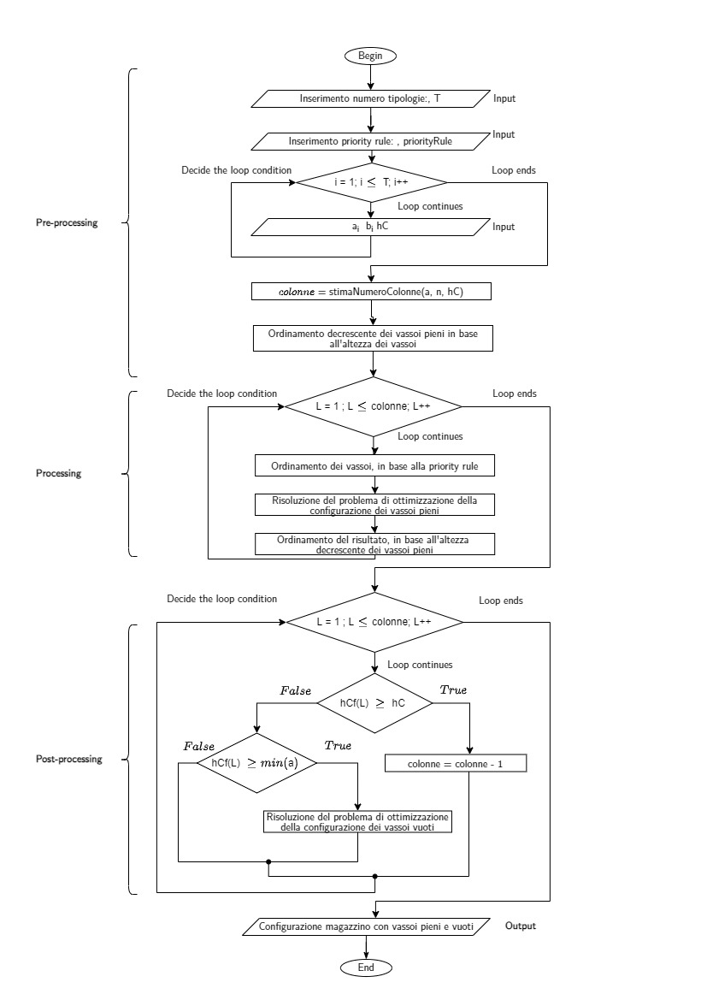
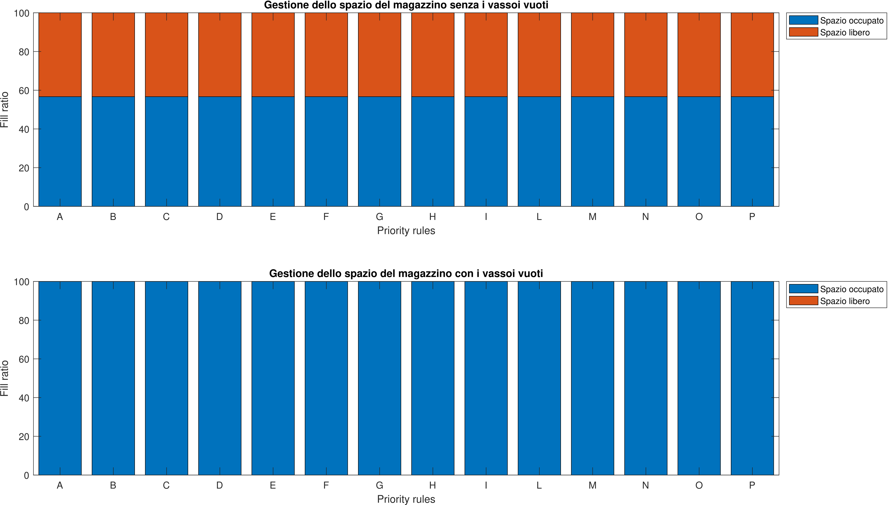
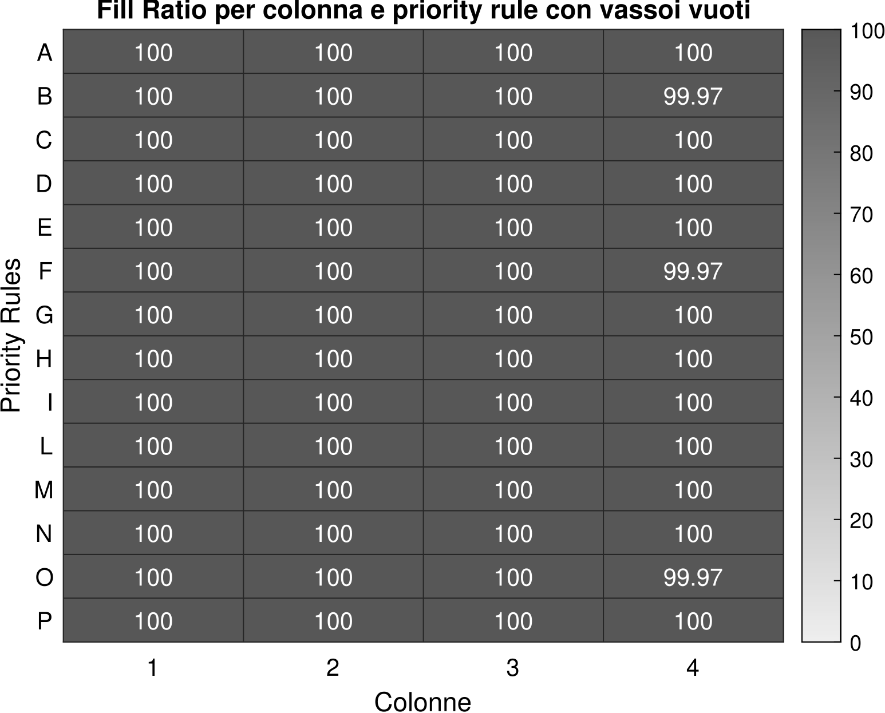

# Vertical Warehouse Optimization

MATLAB project for optimizing tray allocation in Vertical Lift Modules (VLMs), with a focus on storage-space utilization, column fill ratio, priority-rule comparison and memory-aware implementation.

The project models the allocation of trays with different heights inside fixed-height warehouse columns. Full trays are allocated first; then empty trays are inserted into the remaining free space when useful, in order to improve the final fill ratio.

<p align="center">
  
</p>

---

## Project scope

Vertical Lift Modules are automated storage systems that exploit vertical space to reduce floor usage and improve material handling efficiency. This project focuses on the internal allocation problem: given a set of trays, tray quantities and column-height constraints, determine how trays should be assigned to columns while reducing unused vertical space.

The case study is inspired by ICAM SILO² vertical warehouse configurations. The implemented solution is a MATLAB-based optimization workflow developed for an academic project in Dynamical Systems Theory.

---

## Engineering problem

The input problem is defined by:

- tray heights;
- tray quantities;
- number of tray types;
- fixed column height;
- handling clearance between trays;
- selected allocation priority rule.

The objective is to obtain a feasible column allocation that:

- respects the geometric column-height constraint;
- does not allocate more trays than those available;
- follows the selected priority rule;
- avoids empty columns;
- minimizes residual free space;
- improves the final fill ratio by inserting empty trays where possible.

---

## Case-study parameters

The reference simulations use:

| Quantity | Values |
|---|---|
| Tray heights | 75, 125, 225, 325 mm |
| Column heights | 3000, 9000, 15000 mm |
| Handling clearance | 25 mm |
| Scenario sizes | 12, 24, 48 trays |
| Scenario distributions | homogeneous and heterogeneous |
| Evaluation metrics | fill ratio, free space, number of columns, execution time |

The repository contains a cleaned version of the MATLAB implementation and sample project material prepared for reproducibility and portfolio publication.

---

## Business rules

The optimization procedure is based on the following rules:

1. A handling clearance must be considered between trays.
2. The total height of trays assigned to a column must not exceed the column height.
3. The number of trays assigned to a column must not exceed the available quantity for each tray type.
4. The number of trays assigned by type must be coherent with the selected priority rule.
5. The frequency of empty trays should not exceed the frequency of full trays for each tray type.
6. Empty columns are not considered valid allocations.

---

## Algorithm workflow

The algorithm is organized into three stages.

### 1. Pre-processing

Input data are prepared before optimization:

- tray heights and quantities are organized in MATLAB structures;
- tray vectors are checked and reshaped when necessary;
- handling clearance is added to tray heights;
- trays are sorted in descending height order;
- the selected priority rule is applied;
- an initial number of columns is estimated.

### 2. Processing

The full-tray allocation problem is solved:

- trays are ordered according to the selected priority rule;
- feasible combinations are evaluated;
- the best allocation is selected under geometric, availability and priority constraints;
- the result is reordered to preserve a consistent tray-height representation.

### 3. Post-processing

The allocation is refined:

- the initial column estimate is corrected;
- remaining free space is computed for each column;
- columns with enough residual height are selected;
- empty trays are allocated when they improve space usage;
- final fill ratio, free space, number of columns and execution time are computed.

---

## Mathematical model summary

The model uses integer decision variables for tray allocation.

| Symbol | Meaning |
|---|---|
| `N` | Total number of trays |
| `T` | Number of tray types |
| `a_i` | Height of tray type `i` |
| `n_i` | Available quantity of tray type `i` |
| `in_i` | Quantity of tray type `i` already inserted |
| `hC` | Column height |
| `hCf` | Remaining free height in a column |
| `x1_i` | Number of full trays of type `i` assigned to a column |
| `x2_i` | Number of empty trays of type `i` assigned to a column |

### Full-tray allocation

The full-tray model maximizes the occupied height in a column:

```text
maximize sum_i x1_i * a_i
```

subject to:

```text
sum_i x1_i * a_i <= hC
x1_i + in_i <= n_i
x1_i >= 0, integer
```

Additional constraints enforce the selected priority rule and exclude empty column allocations.

### Empty-tray allocation

The empty-tray model is applied to the remaining free height:

```text
maximize sum_i x2_i * a_i - y
```

subject to:

```text
sum_i x2_i * a_i <= hCf
x2_i >= 0, integer
```

A frequency constraint is used to keep the distribution of empty trays coherent with the distribution of full trays.

---

## Priority rules

The project compares several allocation priority rules. These rules define the order in which tray types are selected during optimization.

The rules represent different trade-offs between:

- prioritizing larger trays;
- prioritizing more frequent tray types;
- combining height and quantity information;
- selecting trays according to pseudo-increasing quantity thresholds;
- improving the final column fill ratio.

The priority-rule comparison is one of the main outputs of the project, because different rules can lead to different fill-ratio and execution-time behaviours.

---

## MATLAB implementation

The main optimization entry point has the following structure:

```matlab
function output = optimizationAlgorithm(input, spazioDiPresa, altezzaColonna, priorityRule)

    %% Pre-processing
    input.tipologieVassoi = input.vassoi;
    input.vassoi = input.vassoi + spazioDiPresa;
    input = preProcessing(input, altezzaColonna, priorityRule);

    %% Processing
    work = processing(input);

    %% Post-processing
    output = postProcessing(work);

end
```

The repository is organized so that the main implementation logic is separated into:

- `src/core/` for the main allocation and optimization logic;
- `src/priority-rules/` for priority-rule functions;
- `src/utils/` for support functions and metrics;
- `src/visualization/` for plotting and result visualization;
- `data/sample/` for sample datasets;
- `results/plots/` for generated plots and visual outputs.

---

## RAM-aware feasibility generation

A relevant implementation issue is the generation of feasible combinations for the optimization search space.

The algorithm may generate large matrices containing the possible values of the integer decision variables. Since these matrices are stored as MATLAB `double` arrays, their memory footprint can become large and may trigger a runtime `Out of memory` exception.

To avoid uncontrolled crashes, the implementation uses nested `try/catch` blocks and progressively reduces the size of the generated feasibility matrix.

The fallback logic is:

1. generate the full set of feasible combinations;
2. if MATLAB raises an `Out of memory` exception, limit the decision-variable ranges using average admissible quantities;
3. if memory is still insufficient, limit the ranges using minimum admissible quantities;
4. if the problem is still too large, compute a RAM-based upper bound using the residual available memory.

The implementation estimates the residual memory and uses it to define a safer maximum number of generated values.

For a matrix of `double` values, the memory-aware logic considers:

```text
8 bytes per double value
available residual memory M
number of tray types alpha
number of generated combinations
binary coefficients associated with tray-type selection
```

This is a key engineering feature of the project: the implementation is not only a mathematical formulation, but also includes practical safeguards against combinatorial memory growth.

---

## Results

The project evaluates each configuration using:

- fill ratio;
- residual free space;
- number of columns;
- execution time.

The simulations compare different datasets, column heights and priority rules.

<p align="center">
  
</p>

A second analysis evaluates the improvement obtained by inserting empty trays into the remaining free space.

<p align="center">
  
</p>

Main observations:

- the algorithm generates feasible tray allocations under column-height constraints;
- different priority rules can lead to different fill-ratio and execution-time behaviours;
- the post-processing phase improves space usage by inserting empty trays where possible;
- in most tested cases, the final fill ratio is approximately 100%;
- execution time is generally low for most rules and scenarios, with some critical cases caused by combinatorial growth;
- the number of columns is reduced compared with an over-estimated initial allocation.

---

## How to reproduce

### 1. Clone the repository

```bash
git clone https://github.com/mikabba/vertical-warehouse-optimization.git
cd vertical-warehouse-optimization
```

### 2. Open MATLAB

Set the repository root as the current MATLAB working directory.

### 3. Add source folders to the MATLAB path

```matlab
addpath(genpath("src"));
addpath(genpath("data"));
```

### 4. Run the evaluation script

```matlab
run("src/evalResultMain.m")
```

Depending on the selected dataset and configuration, the scripts evaluate the allocation performance and generate result metrics and plots.

### 5. Inspect results

Generated or imported result material can be found in:

```text
results/plots/
docs/source-code-map.md
docs/results-summary.md
```

If MATLAB path errors occur, verify that all subfolders under `src/` are included with `addpath(genpath("src"))`.

---

## Repository structure

```text
vertical-warehouse-optimization/
├── assets/
│   ├── algorithm-workflow.png
│   ├── fill-ratio-priority-rules.png
│   └── fill-ratio-full-empty-trays.png
├── data/
│   └── sample/
├── docs/
│   ├── algorithm-overview.md
│   ├── mathematical-model.md
│   ├── results-summary.md
│   ├── source-code-map.md
│   └── publication-notes.md
├── results/
│   └── plots/
├── src/
│   ├── core/
│   ├── priority-rules/
│   ├── utils/
│   ├── visualization/
│   ├── evalResult.m
│   └── evalResultMain.m
├── README.md
└── .gitignore
```

---

## Requirements

Recommended environment:

- MATLAB R2022a or newer;
- Optimization Toolbox, if required by the selected optimization functions;
- standard MATLAB plotting utilities.

The original project was developed and tested in MATLAB R2022a.

---

## Limitations

This repository contains a cleaned version of the academic implementation. Some heavy generated outputs, compressed archives and temporary simulation files are intentionally excluded from version control.

The current implementation is based on explicit feasible-combination generation. This is useful for understanding and validating the model, but it can become memory-intensive for large scenarios.

---

## Future work

Possible extensions include:

- replacing brute-force feasible-combination generation with more scalable optimization methods;
- implementing heuristic or evolutionary algorithms;
- integrating order-picking or throughput criteria;
- extending the model to multi-objective optimization;
- improving dataset configuration and automated experiment reproducibility;
- adding unit tests for priority rules and allocation constraints.

---

## Authors

- Michele Abbaticchio
- Nicolò Gentile

---

## Academic context

Project developed for the **Dynamical Systems Theory** course, MSc in Automation Engineering, Politecnico di Bari.

---

## Status

Cleaned engineering version prepared for GitHub portfolio publication.
